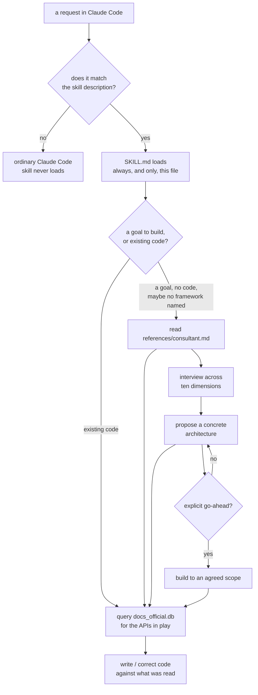

# How It Works

The architecture: how a request reaches the skill, how the skill decides what to do, and why the package is shaped this way. For what is *inside* the knowledge base, see [The Knowledge Base](The-Knowledge-Base.md).

## The shape of the whole thing



Two paths, one database. The consult path queries it twice — before proposing, and again before writing — because a design grounded in a stale reflex wastes the entire interview.

## Repository layout

The repository root is the marketplace. The plugin is a subdirectory with its own manifest, and the project's own harness is the canonical source.

```text
.claude-plugin/marketplace.json      # discovery: points at ./plugins/skills-for-langchain

.claude/skills/langchain/            # CANONICAL — edit here
├── SKILL.md
└── references/
    ├── consultant.md
    └── docs_official.db

plugins/skills-for-langchain/        # PUBLISHED — mirror, byte-identical
├── .claude-plugin/plugin.json       # the version authority
└── skills/langchain/
    ├── SKILL.md
    └── references/
        ├── consultant.md
        └── docs_official.db

scripts/
├── build_docs_db.py                 # rebuilds the database from a docs clone
├── validate_docs_db.py              # asserts the built artifact is sound
└── validate_evidence.py             # SemVer↔CHANGELOG, and mirror byte-identity
```

| Path | Role |
|---|---|
| `.claude/skills/langchain/` | The canonical skill. Every edit starts here. |
| `plugins/skills-for-langchain/` | The strict-validating release package. A real copy, not a symlink. |
| `.claude-plugin/marketplace.json` | The discovery layer. Deliberately carries no version — `plugin.json` is the sole authority. |
| `scripts/` | Repository maintenance. Not part of the plugin; never runs on a user's machine. |
| `docs/wiki/` | This documentation. |
| `docs/plans/` | The design record — one directory per generation of the project. |
| `docs/plans/research/` | The historical probe evidence, preserved unmodified. |
| `assets/` | Project artwork, under separate rights from the code. |

**The duplication is deliberate.** Claude Code plugins ship as-is with no install-time build step, so the published copy has to contain the finished database rather than a recipe for building one. `scripts/validate_evidence.py` compares both trees file-by-file with SHA-256 — including the 4.4 MB binary — so the release copy cannot drift from the canonical one without failing validation. The cost is a second copy of the binary in git history; the benefit is that a published plugin can never silently differ from what the repository says it is.

## How the skill triggers

Claude Code matches a request against the skill's `description` frontmatter. That description names two surfaces on purpose:

- **The consultant surface** — designing or building an agent, automating a multi-step task, building an assistant, answering from data — *even with no framework named and no code shown*.
- **The code surface** — Python importing LangChain, LangGraph, or Deep Agents; calls to `create_agent` or `create_deep_agent`; middleware, subagents, backends, memory, human-in-the-loop, streaming, structured output, deployment.

It also names what should **not** trigger it: CrewAI, AutoGen, LlamaIndex, and raw OpenAI or Anthropic SDK work, unless bridged through LangChain.

The description over-triggers by design, because the costs are asymmetric. A needless load spends a little context. A missed load means the model writes deprecated code with total confidence and neither party ever learns the skill existed.

A framework-agnostic "build me an agent" legitimately loads this skill — and the honesty requirement is what keeps that defensible. Loading on a request that names no framework is only acceptable if the skill will also say "you don't need an agent for this."

You can always force it:

```text
/skills-for-langchain:langchain
```

## How the skill branches

Once loaded, the first section of `SKILL.md` picks a behavior.

**An outcome, a task to automate, or an agent to build** — especially with no existing code — enters the **consultant**. It reads `references/consultant.md` and runs that process: open in plain conversation to understand the goal, converge with focused questions across the ten dimensions, propose something concrete, and write nothing until told to.

**Writing, editing, or reviewing existing ecosystem code** takes the **current-API path**. No interview. It queries the database for the APIs in play and applies the gotchas. This was the entirety of v1.0.0's behavior, and preserving it unregressed was an explicit constraint when the consultant was added.

**Genuine ambiguity** gets one short clarifying question — a single line, not an interview.

## Progressive disclosure

`SKILL.md` is loaded in full every single time the skill triggers, including on a one-line code correction. That budget constraint determines what lives where.

**Always loaded** (`SKILL.md`):

- The branch decision, and a compact consultant posture.
- The ten-dimension checklist as bare prompts to *ask about*.
- A three-layer mental model — LangChain is the framework, LangGraph is the runtime, Deep Agents is the harness.
- **The forcing function:** you do not reliably know the current API; query the database before you rely on it.
- **The gotchas:** removed and renamed APIs, which no search over current documentation can supply.
- The database schema, five worked queries, and the FTS5 syntax notes.

**Loaded on demand** (`references/consultant.md`): the interview walkthrough, the expanded dimension checklist, the build rules, and one worked example. None of it is needed to correct a stale parameter, so making the code path pay for it would tax the common case.

**Queried, never loaded** (`references/docs_official.db`): 3.3 million characters of official documentation. Retrieved a few pages at a time by search, which is the only reason a corpus this size can back a skill at all.

## Why the ten dimensions are questions, not a decision tree

The consultant's checklist deliberately does not map goals to architectures. It lists ten things to make sure you have *asked about* — task shape, single-versus-multi-agent, external data, state and memory, human-in-the-loop, control and safety, reliability, output shape, deployment, and build scope.

The reasoning is that a capable model is already good at mapping a well-understood problem to a sound architecture. That is not where it fails. It fails by **not asking** — by assuming the emails are in Gmail, assuming a human reviews before sending, assuming memory can be global. A decision tree would constrain the part the model does well while leaving the part it does badly untouched. So the checklist guarantees the questions get asked and leaves the mapping to judgment.

The list is capped at ten on purpose. An eleventh dimension is almost always a sub-question of an existing one.

## Why there are no other components

A Claude Code plugin can ship hooks, permissions, MCP servers, agents, and workflows. This one ships none of them.

- **No hooks.** Hooks deterministically intercept tool calls. This project supplies judgment about what code to write, which is not an interception. A hook would add latency without enforcing any boundary.
- **No permissions.** The plugin executes nothing, so there is no tool-access policy to declare. Notably it does *not* pre-approve Write or Edit — pre-approving them would break the consultant's agreement gate, which exists so a design-only conversation stays design-only.
- **No MCP server.** All knowledge is static and local. Fetching at use time would add a network dependency, a failure mode, and nondeterminism to something that currently has none.
- **No custom agents.** This is background knowledge that applies inside the main conversation, not a read-heavy role worth isolating in its own context.
- **No workflows.** The one repeatable procedure — refreshing the database — is two deterministic script invocations run by a maintainer. There is nothing for an orchestration to decide.

## Where the knowledge actually comes from

The short version: a build script clones the official documentation repository, selects 187 core pages, inlines every imported code snippet, and writes a SQLite database with a full-text index and a provenance stamp. Claude queries it with SQL.

The long version, including the schema, the corpus decisions, the two transforms that matter, and how to validate a build, is in [The Knowledge Base](The-Knowledge-Base.md).

---

**Next:** [The Knowledge Base](The-Knowledge-Base.md) for the content layer, or [Customization](Customization.md) to adapt a fork.

Back to the [documentation index](README.md).
