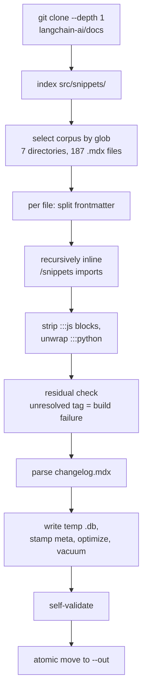

# The Knowledge Base

What is inside `docs_official.db`, how Claude queries it, and how it is rebuilt. This is the page for anyone who wants to know what they actually installed.

## What it is

A single SQLite file, about 4.4 MB, shipped inside the plugin:

```text
.claude/skills/langchain/references/docs_official.db
```

It contains the **complete text of 187 official LangChain documentation pages** — roughly 3.3 million characters, averaging 17 KB per page — plus a full-text search index, a parsed release changelog, and a provenance stamp. It is data, not code. Nothing in it executes.

The design decision behind it is one sentence: **the model should look the API up rather than remember it, and the lookup should not have been pre-summarized by anyone.**

## Provenance

Every copy is stamped with where it came from:

```bash
sqlite3 -readonly references/docs_official.db "SELECT key, value FROM meta;"
```

| Key | Value in the shipped build |
|---|---|
| `snapshot_date` | `2026-07-07` |
| `built_at` | `2026-07-18T01:32:08Z` |
| `source_repo` | `https://github.com/langchain-ai/docs` |
| `source_commit` | `c728061bcaf61e36033431fda83013604387bd07` |
| `doc_count` | `187` |
| `schema_version` | `1` |

`snapshot_date` is derived from the newest dated entry in the upstream changelog, not from the build clock — it answers "how current is this documentation," not "when did someone run the script." That distinction matters: a rebuild from an old clone produces a fresh `built_at` and an unchanged `snapshot_date`, which is the honest answer.

## What is in it

```bash
sqlite3 -readonly references/docs_official.db \
  "SELECT package, COUNT(*) FROM docs GROUP BY package ORDER BY 2 DESC;"
```

| Package | Docs | Source directory |
|---|---|---|
| `langchain` | 73 | `src/oss/langchain` |
| `deepagents` | 53 | `src/oss/deepagents` |
| `langgraph` | 42 | `src/oss/langgraph` |
| `reference` | 9 | `src/oss/reference` |
| `concepts` | 4 | `src/oss/concepts` |
| `migrate` | 3 | `src/oss/python/migrate` |
| `releases` | 3 | `src/oss/python/releases` |

Deep Agents is over-represented relative to its share of the upstream documentation, and deliberately so — it is where the measured knowledge gap was total. Every one of the 14 Deep Agents tasks in the original probe run came back wrong or incomplete.

### What was excluded, and why

Two large exclusions are applied at build time by the corpus globs in `scripts/build_docs_db.py`:

- **All JavaScript documentation.** This is a Python-only skill. A database containing JavaScript examples is a database from which JavaScript can be retrieved and presented as Python — a failure mode worth designing out rather than warning about.
- **`python/integrations`** — 579 files, roughly four times the size of the entire included corpus. It is a parts catalog of individual providers and vector stores, marginal for *designing* an agent, and including it would have made the shipped binary several times larger for little gain.

Neither is a claim that the excluded material is unimportant. It is a claim that this artifact is not where you should look for it.

## Schema

Four tables. It is small on purpose — Claude writes the SQL directly, so the schema has to be readable at a glance.

```sql
CREATE TABLE docs (
    id       INTEGER PRIMARY KEY,
    path     TEXT NOT NULL UNIQUE,   -- e.g. 'deepagents/dynamic-subagents.mdx'
    package  TEXT NOT NULL,          -- langchain | langgraph | deepagents | concepts
                                     -- | reference | migrate | releases
    title    TEXT,                   -- from the page frontmatter
    tag      TEXT,                   -- frontmatter tag, where present
    url      TEXT,                   -- canonical docs.langchain.com URL
    body     TEXT NOT NULL           -- full Markdown, snippets inlined
);

CREATE VIRTUAL TABLE docs_fts USING fts5(
    title, body,
    content='docs', content_rowid='id',
    tokenize='porter unicode61'
);

CREATE TABLE changelog (
    id INTEGER PRIMARY KEY, date TEXT, package TEXT, version TEXT, summary TEXT
);

CREATE TABLE meta (key TEXT PRIMARY KEY, value TEXT);
```

`docs_fts` is an **external-content** FTS5 table: it indexes `docs` rather than duplicating it, which is why a 3.3 MB corpus fits in a 4.4 MB file rather than doubling. Three triggers (`docs_ai`, `docs_ad`, `docs_au`) keep the index synchronized on insert, delete, and update. The `porter` tokenizer means a search for `streaming` also matches `stream` and `streams`.

**Whole-doc rows.** One row per file, not per section. At an average of 17 KB a page, chunking would buy nothing and would cost the ability to read a topic end to end — which is exactly what a model needs when it is about to write code against it.

## How Claude queries it

Always read-only, through the `sqlite3` CLI:

```bash
sqlite3 -readonly references/docs_official.db "<query>"
```

The five queries carried in `SKILL.md` cover essentially everything the skill does:

```sql
-- 1. Ranked concept search. The default move.
SELECT d.path, d.title, snippet(docs_fts, 1, '[', ']', ' … ', 12) AS excerpt
FROM docs_fts JOIN docs d ON d.id = docs_fts.rowid
WHERE docs_fts MATCH 'dynamic subagent' ORDER BY rank LIMIT 5;

-- 2. Narrow to one package.
SELECT d.path, d.title
FROM docs_fts JOIN docs d ON d.id = docs_fts.rowid
WHERE d.package = 'deepagents' AND docs_fts MATCH 'interrupt OR human'
ORDER BY rank LIMIT 8;

-- 3. Read a whole page, once a search has pointed at it.
SELECT body FROM docs WHERE path = 'deepagents/dynamic-subagents.mdx';

-- 4. What changed recently.
SELECT date, package, version, summary FROM changelog ORDER BY date DESC LIMIT 15;

-- 5. Provenance.
SELECT key, value FROM meta;
```

The working pattern is **search, then read in full**: FTS to find the right page, then pull the entire `body` and write code against what it says. Skimming excerpts is how details get missed.

### FTS5 syntax that bites

Raw SQL is the one real cost of this design, and `MATCH` is where it shows up:

- `'dynamic subagent'` requires **both** terms. Use `OR` for alternatives.
- `"exact phrase"` in double quotes for phrases.
- A token containing a hyphen, parenthesis, or heavy underscores can parse as an **operator** rather than a term. Wrap it: `'"with_fallbacks"'`.
- Scope to a column with `title : middleware`.

When a search returns nothing, the fix is almost always to broaden — drop a word, try a synonym — rather than to fall back on memory.

## How it is built



One command, given a clone:

```bash
python3 scripts/build_docs_db.py \
  --src .tmp/docs_langchain \
  --out .claude/skills/langchain/references/docs_official.db \
  --mirror plugins/skills-for-langchain/skills/langchain/references/docs_official.db
```

The script is standard-library Python 3.10+ with no third-party dependencies and no network access of its own — the clone is a separate step, which keeps the build deterministic and idempotent on a fixed source. It preflights that the running SQLite has FTS5, builds to a temporary file, self-validates, and only then atomically moves the result into place, so a failed build never leaves a half-written database where a working one used to be.

### The two transforms that matter

Everything else is conservative; these two are mandatory.

**Snippet inlining.** Upstream pages do not contain their code. They `import` it from `/snippets/...` and render it as a JSX tag. A naive copy of a page body therefore captures the prose and loses the code — which is precisely what made the old distilled references worse than they looked. The build resolves every import, **recursively**, because snippets themselves import further snippets. A missing target or an import cycle is a hard build failure, not a warning. The shipped build performed **346 substitutions** across 187 pages.

The residual check is scoped to component names that were actually imported, rather than to any self-closing tag. Otherwise legitimate JSX inside a code example — `<LoadingIndicator />` in a React sample — would fail the build for looking like an unresolved snippet.

**Language conditionals.** Upstream marks language-specific passages with `:::python` and `:::js` fences. JavaScript blocks are removed entirely; Python blocks are unwrapped. The subtlety is that Mintlify nests these by **increasing the colon count** — an outer `::::::js` can wrap an inner `:::python` — so a bare closing fence has to be matched to its opener by colon count. The build keeps a fence stack for exactly this. Matching by line position instead silently corrupts nested pages, which is how this was discovered.

## Validating a build

```bash
python3 scripts/validate_docs_db.py
```

It opens the shipped artifact read-only and asserts the invariants that make it trustworthy:

| Check | Why it exists |
|---|---|
| All four tables present | Basic schema integrity. |
| `doc_count` within 150–250 | Catches a corpus glob that silently matched nothing, or everything. |
| `changelog` non-empty | Catches an upstream changelog format change breaking the parser. |
| Zero leftover `/snippets` import lines | Snippet inlining actually ran. |
| Zero `:::js` leakage | JavaScript did not survive into a Python-only artifact. |
| `dynamic-subagents` body contains `create_deep_agent(` | **The regression this whole database exists for.** If the code that distillation dropped is not present, the build has reproduced the original defect. |
| `docs_fts MATCH 'agent'` returns rows | The search index is populated, not just present. |
| Every `meta` key populated | The artifact is traceable to a source commit. |

Note that CI does not currently run this script — it runs `validate_evidence.py` and the manifest validations. Run it locally whenever you touch the database or the build script.

## Why SQLite and raw SQL

Three alternatives were considered and rejected, and the reasoning is worth keeping:

**Vector embeddings** would give semantic search, and would require an embedding model, an API key, and per-query cost inside a plugin that is supposed to be a self-contained file. Too fragile to ship.

**A folder of Markdown searched with ripgrep** would be simpler, and gives no ranking and no metadata filtering — and ships as a directory rather than a single artifact.

**A `query_docs.py` helper wrapping the database** would hide the FTS5 syntax quirks behind a friendlier interface, and would be one more piece of code to maintain and version alongside the schema. Raw SQL adds nothing to maintain; its only real cost is `MATCH` syntax, which is paid once by putting worked examples in `SKILL.md`.

## The limit of the whole approach

A database of *current* documentation can show what exists. It can never show what was **removed** — you cannot search for the absence of a page.

This is the entire justification for the gotchas list in `SKILL.md`. When the model reaches for `create_react_agent`, or the deleted `supervisor` package, or `.with_fallbacks()` on an agent, no query against current docs will correct it; the database will simply return nothing, and returning nothing is indistinguishable from "no results for this phrasing." So roughly ten lines of hand-written knowledge survive, scoped precisely to removed and renamed APIs.

It is the only curated content left in the project, and it exists because of a structural property of search, not because anyone preferred it.

---

**Next:** [Coverage and Limits](Coverage-and-Limits.md) for where this stops being reliable, or [Maintenance and Release](Maintenance-and-Release.md) to refresh it.

Back to the [documentation index](README.md).
